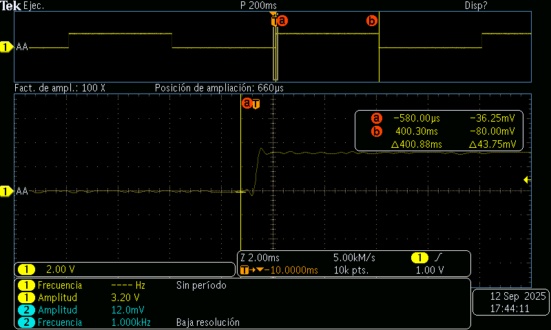
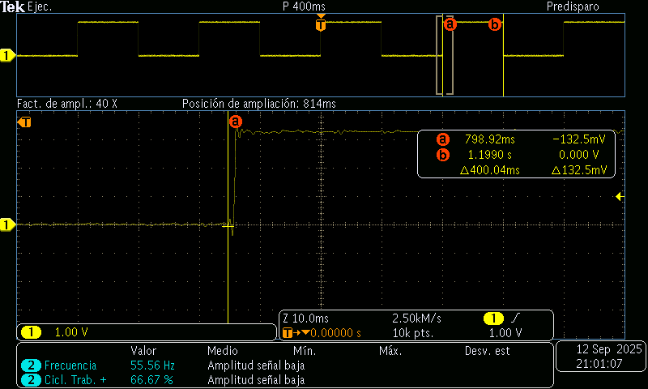
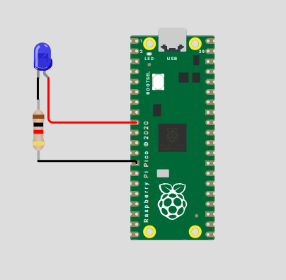

# 🤖 Tarea 5: Ejercicio de Medición.

> Garcia Cortez Juan David · Arai Erazo Sumie ·  Sistemas Embebidos 1  ·  15/09/2025.

---


## Medición en osciloscopio del periodo y jitter usando ALARM0 (modo µs)
* Genera una onda cuadrada por toggle de un pin de salida en la ISR de ALARM0, con rearme acumulativo y periodo nominal definido por ti (p. ej., 100 µs–5 ms). Mide con osciloscopio:

* Periodo promedio y tolerancia.

* Jitter pico-a-pico y, si tu equipo lo permite, RMS. 
Describe la configuración del osciloscopio (acoplamiento, escala de tiempo/voltaje, modo de medición). No cambiar la resolución del timer (mantener modo µs).

### Código
```bash
// Blink con timer (SDK alto nivel): cambia BLINK_MS para ajustar
#include "pico/stdlib.h"
#include "pico/time.h"

#define LED_PIN 6
static const int BLINK_MS = 100;  // <-- ajusta tu periodo aquí

bool blink_cb(repeating_timer_t *t) {
    static bool on = false;
    gpio_put(LED_PIN, on = !on);
    return true; // seguir repitiendo la alarma
}

int main() {
    stdio_init_all();

    gpio_init(LED_PIN);
    gpio_set_dir(LED_PIN, true);

    repeating_timer_t timer;
    // Programa una interrupción periódica cada BLINK_MS:
    add_repeating_timer_ms(BLINK_MS, blink_cb, NULL, &timer);

    while (true) {
        // El trabajo "pesado" debería ir aquí (no en la ISR).
        tight_loop_contents();
    }
}
```
### Imagen del Osciloscopio


* El osciloscopio se encuentra con una escala del 50X, a una posición de 2.58 microsegundos. Una diferencia de tiempo de 100 microsegundos y una diferencia de voltaje de 37.19 mV


## Comparar jitter/precisión con osciloscopio: modo µs vs modo ciclos
* Genera una señal por toggle en la ISR de ALARM0, primero en modo µs y luego en modo ciclos de clk_sys (mismo periodo nominal). En ambos casos:

* Usa rearme acumulativo.

* Mantén el resto del código idéntico.
* Con el osciloscopio, mide y registra para cada modo:

* Periodo promedio y desviación respecto al nominal.

* Jitter pico-a-pico y/o RMS.
* Compara resultados y discute el compromiso entre resolución de tick y horizonte de programación.

#### Código con microsegundos
```bash
// Blink con timer de sistema (bajo nivel): programando ALARM0 e IRQ
#include "pico/stdlib.h"
#include "hardware/irq.h"
#include "hardware/structs/timer.h"

#define LED_PIN       6
#define ALARM_NUM     0  // usaremos la alarma 0

// Calcula el número de IRQ para esa alarma 
#define ALARM_IRQ     timer_hardware_alarm_get_irq_num(timer_hw, ALARM_NUM)

static volatile uint32_t next_deadline;   // próximo instante (en us) en 32 bits bajos
// Por defecto el timer cuenta µs (no cambiamos la fuente).
static volatile uint32_t intervalo_us = 400u;    // periodo en microsegundos

void on_alarm_irq(void) {
    // 1) Limpiar el flag de la alarma
    hw_clear_bits(&timer_hw->intr, 1u << ALARM_NUM);

    // 2) Hacer el trabajo toggle LED
    sio_hw->gpio_togl = 1u << LED_PIN;

    // 3) Rearmar la siguiente alarma con "deadline acumulativo"
    next_deadline += intervalo_us;
    timer_hw->alarm[ALARM_NUM] = next_deadline;
}

int main() {
    stdio_init_all();

    // Configura el LED
    gpio_init(LED_PIN);
    gpio_set_dir(LED_PIN, true);

    // "now" = 32 bits bajos del contador (tiempo en µs)
    uint32_t now_us = timer_hw->timerawl;          // lectura 32b (low) del contador
    next_deadline = now_us + intervalo_us;         // primer deadline

    // Programa la alarma
    timer_hw->alarm[ALARM_NUM] = next_deadline;

    // Crea un handler exclusivo para ligar el callback a la IRQ de la alarma
    irq_set_exclusive_handler(ALARM_IRQ, on_alarm_irq);
    // Habilita dentro del periférico TIMER la fuente de interrupción para la alarma ALARM_NUM inte = interrupt enable
    hw_set_bits(&timer_hw->inte, 1u << ALARM_NUM);
    //Habilita la IRQ en el NVIC (controlador de interrupciones del núcleo)
    irq_set_enabled(ALARM_IRQ, true);

    while (true) {
        // Mantén el bucle principal libre; lo pesado va aquí, no en la ISR
        tight_loop_contents();
    }
}
```

#### Imagen del Osciloscopio



#### Código con Ciclos
```bash
#include "pico/stdlib.h"
#include "hardware/irq.h"
#include "hardware/structs/timer.h"

#define LED_PIN       6
#define ALARM_NUM     0  // usaremos la alarma 0
// Calcula el número de IRQ para esa alarma 
#define ALARM_IRQ     timer_hardware_alarm_get_irq_num(timer_hw, ALARM_NUM)

#define CLK_SYS_HZ    150000000u
static volatile uint32_t next_deadline;   
static volatile uint32_t intervalo_ciclos = (CLK_SYS_HZ /1000000u)* 400u;    // periodo en microsegundos

void on_alarm_irq(void) {
    // 1) Limpiar el flag de la alarma
    hw_clear_bits(&timer_hw->intr, 1u << ALARM_NUM);

    // 2) Hacer el trabajo toggle LED
    sio_hw->gpio_togl = 1u << LED_PIN;

    // 3) Rearmar la siguiente alarma con "deadline acumulativo"
    next_deadline += intervalo_ciclos;
    timer_hw->alarm[ALARM_NUM] = next_deadline;
}

int main() {
    stdio_init_all();

    // Configura el LED
    gpio_init(LED_PIN);
    gpio_set_dir(LED_PIN, true);

    timer_hw->timerctrl = TIMER_TIMERCTRL_CLK_SYS_BITS;


    // "now" = 32 bits bajos del contador (tiempo en µs)
    uint32_t now_cycles = timer_hw->timerawl;          
    next_deadline = now_cycles + intervalo_ciclos;         

    timer_hw->alarm[ALARM_NUM] = next_deadline;

    // Crea un handler exclusivo para ligar el callback a la IRQ de la alarma
    irq_set_exclusive_handler(ALARM_IRQ, on_alarm_irq);

    hw_set_bits(&timer_hw->inte, 1u << ALARM_NUM);
   
    irq_set_enabled(ALARM_IRQ, true);

    while (true) {
        // Mantén el bucle principal libre; lo pesado va aquí, no en la ISR
        tight_loop_contents();
    }
}
```

#### Imagen del Osciloscopio


* Podemos concluir que el uso de los ciclos es más exacto y preciso para analizar señales rápidas y medir variaciones entre ciclos individuales. 

#### Esquemático Utilizado en la Práctica

