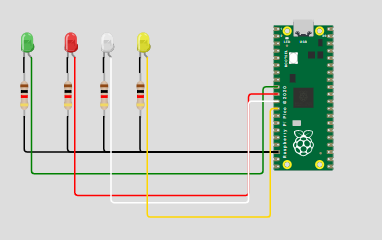
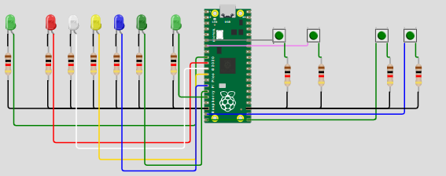

# 🤖 Tarea 6: Ejercicios de Programación
> Garcia Cortez Juan David · Arai Erazo Sumie ·  Sistemas Embebidos 1  ·  16/09/2025.

--- 

## Ejercicio 1
* Configurar ALARM0..ALARM3 del timer de sistema en modo µs. Cada alarma controla un LED distinto con un periodo propio. 

### Código que debía funcionar
```bash
#include "pico/stdlib.h"
#include "hardware/irq.h"
#include "hardware/structs/timer.h"
#include "hardware/gpio.h"

#define LED0_PIN     6   
#define LED1_PIN     7
#define LED2_PIN     8
#define LED3_PIN     9                     

#define ALARM0_NUM   0
#define ALARM1_NUM   1
#define ALARM2_NUM   2
#define ALARM3_NUM   3

#define ALARM0_IRQ   timer_hardware_alarm_get_irq_num(timer_hw, ALARM0_NUM)
#define ALARM1_IRQ   timer_hardware_alarm_get_irq_num(timer_hw, ALARM1_NUM)
#define ALARM2_IRQ   timer_hardware_alarm_get_irq_num(timer_hw, ALARM2_NUM)
#define ALARM3_IRQ   timer_hardware_alarm_get_irq_num(timer_hw, ALARM3_NUM)


// Próximos "deadlines" (32 bits bajos en µs) y sus intervalos en µs
static volatile uint32_t next0_us, next1_us, next2_us, next3_us;
static const uint32_t INTERVALO0_US = 250u;
static const uint32_t INTERVALO1_US = 400u;
static const uint32_t INTERVALO2_US = 500u;
static const uint32_t INTERVALO3_US = 800u;

// ISR para ALARM0
static void on_alarm0_irq(void) {
    hw_clear_bits(&timer_hw->intr, 1u << ALARM0_NUM);
    sio_hw->gpio_togl = 1u << LED0_PIN;
    next0_us += INTERVALO0_US;
    timer_hw->alarm[ALARM0_NUM] = next0_us;
}

// ISR para ALARM1
static void on_alarm1_irq(void) {
    hw_clear_bits(&timer_hw->intr, 1u << ALARM1_NUM);
    sio_hw->gpio_togl = 1u << LED1_PIN;
    next1_us += INTERVALO1_US;
    timer_hw->alarm[ALARM1_NUM] = next1_us;
}
// ISR para ALARM2
static void on_alarm2_irq(void) {
    hw_clear_bits(&timer_hw->intr, 1u << ALARM2_NUM);
    sio_hw->gpio_togl = 1u << LED2_PIN;
    next2_us += INTERVALO2_US;
    timer_hw->alarm[ALARM2_NUM] = next2_us;
}
// ISR para ALARM3
static void on_alarm3_irq(void) {
    hw_clear_bits(&timer_hw->intr, 1u << ALARM3_NUM);
    sio_hw->gpio_togl = 1u << LED3_PIN;
    next3_us += INTERVALO3_US;
    timer_hw->alarm[ALARM3_NUM] = next3_us;
}

int main() {

    gpio_init(LED0_PIN);
    gpio_set_dir(LED0_PIN, GPIO_OUT);
    gpio_put(LED0_PIN, 0);

    gpio_init(LED1_PIN);
    gpio_set_dir(LED1_PIN, GPIO_OUT);
    gpio_put(LED1_PIN, 0);

    gpio_init(LED2_PIN);
    gpio_set_dir(LED2_PIN, GPIO_OUT);
    gpio_put(LED2_PIN, 0);

    gpio_init(LED3_PIN);
    gpio_set_dir(LED3_PIN, GPIO_OUT);
    gpio_put(LED3_PIN, 0);

    // Timer de sistema en microsegundos (por defecto source = 0)
    timer_hw->source = 0u;

    uint32_t now_us = timer_hw->timerawl;

    // Primeros deadlines
    next0_us = now_us + INTERVALO0_US;
    next1_us = now_us + INTERVALO1_US;
    next2_us = now_us + INTERVALO2_US;
    next3_us = now_us + INTERVALO3_US;

    // Programa ambas alarmas
    timer_hw->alarm[ALARM0_NUM] = next0_us;
    timer_hw->alarm[ALARM1_NUM] = next1_us;
    timer_hw->alarm[ALARM2_NUM] = next2_us;
    timer_hw->alarm[ALARM3_NUM] = next3_us;

    // Limpia flags pendientes antes de habilitar
    hw_clear_bits(&timer_hw->intr, (1u << ALARM0_NUM) | (1u << ALARM1_NUM) | (1u << ALARM2_NUM) | (1u << ALARM3_NUM));

    // Registra handlers exclusivos para cada alarma
    irq_set_exclusive_handler(ALARM0_IRQ, on_alarm0_irq);
    irq_set_exclusive_handler(ALARM1_IRQ, on_alarm1_irq);
    irq_set_exclusive_handler(ALARM2_IRQ, on_alarm2_irq);
    irq_set_exclusive_handler(ALARM3_IRQ, on_alarm3_irq);

    // Habilita fuentes de interrupción en el periférico TIMER
    hw_set_bits(&timer_hw->inte, (1u << ALARM0_NUM) | (1u << ALARM1_NUM) | (1u << ALARM2_NUM) | (1u << ALARM3_NUM));

    // Habilita ambas IRQ en el NVIC
    irq_set_enabled(ALARM0_IRQ, true);
    irq_set_enabled(ALARM1_IRQ, true);
    irq_set_enabled(ALARM2_IRQ, true);
    irq_set_enabled(ALARM3_IRQ, true);

    // Bucle principal: todo el parpadeo ocurre en las ISRs
    while (true) {
        tight_loop_contents();
    }
}
```
### Código que funcionó
```bash
// Tres LEDs con alarmas del timer + un LED controlado por polling en el main loop
// - ALARM0 controla el LED en GPIO 6
// - ALARM1 controla el LED en GPIO 7
// - ALARM2 controla el LED en GPIO 8
// - GPIO 9 se controla por polling en el bucle principal

#include "pico/stdlib.h"
#include "hardware/irq.h"
#include "hardware/structs/timer.h"
#include "hardware/gpio.h"

// Definición de pines para los LEDs
#define LED0_PIN     6  // LED en GPIO 6 (ALARM0)
#define LED1_PIN     7  // LED en GPIO 7 (ALARM1)
#define LED2_PIN     8  // LED en GPIO 8 (ALARM2)
#define LED3_PIN     9  // LED en GPIO 9 (polling)

// Números de alarma (solo existen 0, 1, 2)
#define ALARM0_NUM   0
#define ALARM1_NUM   1
#define ALARM2_NUM   2

// IRQs para cada alarma
#define ALARM0_IRQ   timer_hardware_alarm_get_irq_num(timer_hw, ALARM0_NUM)
#define ALARM1_IRQ   timer_hardware_alarm_get_irq_num(timer_hw, ALARM1_NUM)
#define ALARM2_IRQ   timer_hardware_alarm_get_irq_num(timer_hw, ALARM2_NUM)

// Próximos "deadlines" (32 bits bajos en µs) y sus intervalos en µs
static volatile uint32_t next0_us, next1_us, next2_us;
static const uint32_t INTERVALO0_US = 250000u;  // 250 ms
static const uint32_t INTERVALO1_US = 400000u;  // 400 ms
static const uint32_t INTERVALO2_US = 600000u;  // 600 ms
static const uint32_t INTERVALO3_US = 1000000u; // 1000 ms

// Para el LED controlado por polling
static volatile uint32_t next_poll_us = 0;

// ISR para ALARM0
static void on_alarm0_irq(void) {
    hw_clear_bits(&timer_hw->intr, 1u << ALARM0_NUM);
    sio_hw->gpio_togl = 1u << LED0_PIN;
    next0_us += INTERVALO0_US;
    timer_hw->alarm[ALARM0_NUM] = next0_us;
}

// ISR para ALARM1
static void on_alarm1_irq(void) {
    hw_clear_bits(&timer_hw->intr, 1u << ALARM1_NUM);
    sio_hw->gpio_togl = 1u << LED1_PIN;
    next1_us += INTERVALO1_US;
    timer_hw->alarm[ALARM1_NUM] = next1_us;
}

// ISR para ALARM2
static void on_alarm2_irq(void) {
    hw_clear_bits(&timer_hw->intr, 1u << ALARM2_NUM);
    sio_hw->gpio_togl = 1u << LED2_PIN;
    next2_us += INTERVALO2_US;
    timer_hw->alarm[ALARM2_NUM] = next2_us;
}

int main() {
    // Configuración de los pines de los LEDs
    gpio_init(LED0_PIN);
    gpio_set_dir(LED0_PIN, GPIO_OUT);
    gpio_put(LED0_PIN, 0);

    gpio_init(LED1_PIN);
    gpio_set_dir(LED1_PIN, GPIO_OUT);
    gpio_put(LED1_PIN, 0);

    gpio_init(LED2_PIN);
    gpio_set_dir(LED2_PIN, GPIO_OUT);
    gpio_put(LED2_PIN, 0);

    gpio_init(LED3_PIN);
    gpio_set_dir(LED3_PIN, GPIO_OUT);
    gpio_put(LED3_PIN, 0);

    // Timer de sistema en microsegundos (por defecto source = 0)
    timer_hw->source = 0u;

    uint32_t now_us = timer_hw->timerawl;

    // Primeros deadlines para cada alarma
    next0_us = now_us + INTERVALO0_US;
    next1_us = now_us + INTERVALO1_US;
    next2_us = now_us + INTERVALO2_US;
    next_poll_us = now_us + INTERVALO3_US;

    // Programa las tres alarmas disponibles
    timer_hw->alarm[ALARM0_NUM] = next0_us;
    timer_hw->alarm[ALARM1_NUM] = next1_us;
    timer_hw->alarm[ALARM2_NUM] = next2_us;

    // Limpia flags pendientes antes de habilitar
    hw_clear_bits(&timer_hw->intr, (1u << ALARM0_NUM) | (1u << ALARM1_NUM) | 
                                   (1u << ALARM2_NUM));

    // Registra handlers exclusivos para cada alarma
    irq_set_exclusive_handler(ALARM0_IRQ, on_alarm0_irq);
    irq_set_exclusive_handler(ALARM1_IRQ, on_alarm1_irq);
    irq_set_exclusive_handler(ALARM2_IRQ, on_alarm2_irq);

    // Habilita fuentes de interrupción en el periférico TIMER
    hw_set_bits(&timer_hw->inte, (1u << ALARM0_NUM) | (1u << ALARM1_NUM) | 
                                 (1u << ALARM2_NUM));

    // Habilita todas las IRQ en el NVIC
    irq_set_enabled(ALARM0_IRQ, true);
    irq_set_enabled(ALARM1_IRQ, true);
    irq_set_enabled(ALARM2_IRQ, true);

    // Bucle principal: controlamos el cuarto LED por polling
    while (true) {
        uint32_t current_time = timer_hw->timerawl;
        
        // Control por polling del cuarto LED
        if ((int32_t)(current_time - next_poll_us) >= 0) {
            sio_hw->gpio_togl = 1u << LED3_PIN;
            next_poll_us += INTERVALO3_US;
        }
    }
}
```

### Esquemático


### Video
<iframe width="560" height="315" src="https://www.youtube.com/embed/ffViBdU1jA0" frameborder="0" allowfullscreen></iframe>

## Ejercicio 2
* Modificar su pong, para tener dos botones adicionales, que suban y bajen la velocidad del juego sin delay

### Código
```bash
#include "pico/stdlib.h"
#include "hardware/gpio.h"
#include "hardware/irq.h"
#include "hardware/structs/timer.h"

// Pines
#define P1 4
#define P2 5
#define WIN1 6
#define LED1 7
#define LED2 8
#define LED3 9
#define LED4 10
#define LED5 11
#define WIN2 12
#define BTN_SLOW 14
#define BTN_FAST 15

#define ALARM0_NUM 0
#define ALARM0_IRQ timer_hw->intr

// LEDs
const uint LEDS[] = {WIN1, LED1, LED2, LED3, LED4, LED5, WIN2};

// Estado del juego
volatile int posicion = LED3;
volatile int direccion = 1;
volatile bool flag_p1 = false;
volatile bool flag_p2 = false;
volatile bool flag_slow = false;
volatile bool flag_fast = false;
volatile bool juego_activo = true;

// Intervalo de movimiento en µs
volatile uint32_t intervalo_us = 200000;
volatile uint32_t next_alarm_us = 0;

// Parpadeo de LED ganador
void parpadear_led(uint led) {
    for (int i = 0; i < 3; i++) {
        gpio_put(led, 1);
        sleep_ms(300);
        gpio_put(led, 0);
        sleep_ms(300);
    }
}

// Interrupciones GPIO
void gpio_callback(uint gpio, uint32_t events) {
    if (events & GPIO_IRQ_EDGE_RISE) {
        if (gpio == P1) flag_p1 = true;
        else if (gpio == P2) flag_p2 = true;
        else if (gpio == BTN_SLOW) flag_slow = true;
        else if (gpio == BTN_FAST) flag_fast = true;
    }
}

// Interrupción de ALARM0
void on_alarm0_irq() {
    // Limpiar flag
    hw_clear_bits(&timer_hw->intr, 1u << ALARM0_NUM);

    if (!juego_activo) return;

    // Apagar todos los LEDs
    for (int i = 0; i < 7; i++) gpio_put(LEDS[i], 0);

    // Encender LED actual
    gpio_put(posicion, 1);

    // Cambiar dirección solo si el LED está en el extremo
    if (posicion == LED1) {
        if (flag_p1) {
            direccion = 1;
            flag_p1 = false;
        }
    } else if (posicion == LED5) {
        if (flag_p2) {
            direccion = -1;
            flag_p2 = false;
        }
    }

    // Ajustar velocidad
    if (flag_slow) {
        intervalo_us += 50000;
        if (intervalo_us > 1000000) intervalo_us = 1000000;
        flag_slow = false;
    }
    if (flag_fast) {
        if (intervalo_us > 50000) intervalo_us -= 50000;
        flag_fast = false;
    }

    // Verificar victoria
    if (posicion == WIN1) {
        parpadear_led(WIN2);
        juego_activo = false;
        direccion = 1;
        return;
    } else if (posicion == WIN2) {
        parpadear_led(WIN1);
        juego_activo = false;
        direccion = -1;
        return;
    }

    // Mover LED
    posicion += direccion;

    // Reprogramar alarma
    next_alarm_us += intervalo_us;
    timer_hw->alarm[ALARM0_NUM] = next_alarm_us;
}

int main() {
    stdio_init_all();

    // Inicializar LEDs
    for (int i = 0; i < 7; i++) {
        gpio_init(LEDS[i]);
        gpio_set_dir(LEDS[i], GPIO_OUT);
        gpio_put(LEDS[i], 0);
    }

    // Inicializar botones
    gpio_init(P1); gpio_set_dir(P1, GPIO_IN); gpio_pull_up(P1);
    gpio_init(P2); gpio_set_dir(P2, GPIO_IN); gpio_pull_up(P2);
    gpio_init(BTN_SLOW); gpio_set_dir(BTN_SLOW, GPIO_IN); gpio_pull_up(BTN_SLOW);
    gpio_init(BTN_FAST); gpio_set_dir(BTN_FAST, GPIO_IN); gpio_pull_up(BTN_FAST);

    // Configurar interrupciones GPIO
    gpio_set_irq_enabled_with_callback(P1, GPIO_IRQ_EDGE_RISE, true, &gpio_callback);
    gpio_set_irq_enabled(P2, GPIO_IRQ_EDGE_RISE, true);
    gpio_set_irq_enabled(BTN_SLOW, GPIO_IRQ_EDGE_RISE, true);
    gpio_set_irq_enabled(BTN_FAST, GPIO_IRQ_EDGE_RISE, true);

    // Configurar TIMER
    timer_hw->source = 0u;
    irq_set_exclusive_handler(timer_hardware_alarm_get_irq_num(timer_hw, ALARM0_NUM), on_alarm0_irq);
    irq_set_enabled(timer_hardware_alarm_get_irq_num(timer_hw, ALARM0_NUM), true);
    hw_set_bits(&timer_hw->inte, 1u << ALARM0_NUM);

    while (true) {
        // Reiniciar estado
        posicion = LED3;
        juego_activo = true;
        intervalo_us = 200000;

        // Programar primera alarma
        next_alarm_us = timer_hw->timerawl + intervalo_us;
        timer_hw->alarm[ALARM0_NUM] = next_alarm_us;

        // Esperar fin del juego
        while (juego_activo) {
            tight_loop_contents();
        }

        sleep_ms(1000); // Espera antes de reiniciar
    }
}
```
### Esquemático


### Video
<iframe width="560" height="315" src="https://www.youtube.com/embed/CuD0zj_AnYM" frameborder="0" allowfullscreen></iframe>
