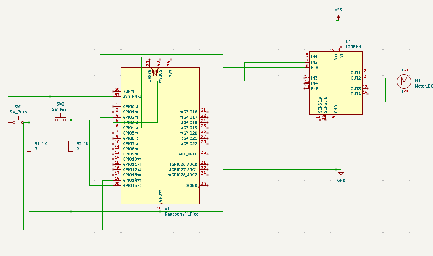

# 🤖 Tarea 7.1: PWM
> Garcia Cortez Juan David · Arai Erazo Sumie ·  Sistemas Embebidos 1  ·  01/10/2025.

--- 
## Control de Duty Cycle — Motor DC
* Entregable: 
* Implementar un circuito con un motor DC controlado mediante PWM  variando el duty cycle. 
* Usar 2 botones para seleccionar entre 3 velocidades predefinidas (baja, media y alta).

* Documentar:

* Valores de duty usados, con el porque.
* No olvidar que el microcontrolador no entrega suficiente potencia, se debe usar un puente H o driver de motor para conectar el motor DC.

### Código
```bash
#include "pico/stdlib.h"
#include "hardware/pwm.h"

#define ENA 2       // Pin PWM (velocidad del motor)
#define IN1 3       // Dirección (H-Bridge)
#define IN2 4       // Dirección (H-Bridge)
#define BTN_UP 14   // Botón para subir velocidad
#define BTN_DOWN 15 // Botón para bajar velocidad

#define F_PWM_HZ 2000   // Frecuencia de PWM
#define TOP 1023        // Resolución de 10 bits (0–1023)

// Valores de duty cycle (equivalentes a 40%, 60% y 80%)
const uint16_t duty_values[] = {410, 615, 820};

int speed_index = 1;  // Empezar en el valor medio (60%)

bool last_up = true;
bool last_down = true;

// -----------------------------------------------------
// Función para establecer la velocidad del motor (duty cycle)
// -----------------------------------------------------
void set_motor_speed(uint slice, uint chan, uint16_t duty) {
    // Si el duty es bajo, hacer un “arranque forzado” al 100%
    if (duty > 0 && duty <= 410) { // equivalente al 40%
        pwm_set_chan_level(slice, chan, TOP); // duty = 100%
        sleep_ms(100);
    }

    pwm_set_chan_level(slice, chan, duty);
}

int main() {
    stdio_init_all();

    // Configurar pines de dirección
    gpio_init(IN1);
    gpio_set_dir(IN1, GPIO_OUT);
    gpio_put(IN1, 1);

    gpio_init(IN2);
    gpio_set_dir(IN2, GPIO_OUT);
    gpio_put(IN2, 0);

    // Configurar botones
    gpio_init(BTN_UP);
    gpio_set_dir(BTN_UP, GPIO_IN);
    gpio_pull_up(BTN_UP);

    gpio_init(BTN_DOWN);
    gpio_set_dir(BTN_DOWN, GPIO_IN);
    gpio_pull_up(BTN_DOWN);

    // Configurar PWM
    gpio_set_function(ENA, GPIO_FUNC_PWM);
    uint slice = pwm_gpio_to_slice_num(ENA);
    uint chan  = pwm_gpio_to_channel(ENA);

    float f_clk = 125000000.0f;
    float div = f_clk / (F_PWM_HZ * (TOP + 1));
    pwm_set_clkdiv(slice, div);
    pwm_set_wrap(slice, TOP);

    // Iniciar en velocidad media
    set_motor_speed(slice, chan, duty_values[speed_index]);
    pwm_set_enabled(slice, true);

    while (true) {
        bool up_now = gpio_get(BTN_UP);
        bool down_now = gpio_get(BTN_DOWN);

        // Botón UP
        if (last_up && !up_now) {
            sleep_ms(50);
            if (!gpio_get(BTN_UP)) {
                if (speed_index < 2) speed_index++;
                set_motor_speed(slice, chan, duty_values[speed_index]);
            }
        }

        // Botón DOWN
        if (last_down && !down_now) {
            sleep_ms(50);
            if (!gpio_get(BTN_DOWN)) {
                if (speed_index > 0) speed_index--;
                set_motor_speed(slice, chan, duty_values[speed_index]);
            }
        }

        last_up = up_now;
        last_down = down_now;
        sleep_ms(10);
    }
}
```

### Esquemático


### Video
<iframe width="560" height="315" src="https://www.youtube.com/embed/pIVArhZPAX4" frameborder="0" allowfullscreen></iframe>
