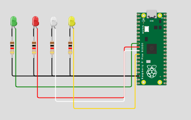

# 🤖 Tarea 7.2: PWM
> Garcia Cortez Juan David · Arai Erazo Sumie ·  Sistemas Embebidos 1  ·  01/10/2025.

--- 
## Control con frecuencia buzzer
* Entregable:

* Programar un buzzer piezoeléctrico para reproducir una melodía reconocible.

* Variar la frecuencia del PWM para las notas, manteniendo el duty en 50 %.

* Cada nota debe incluir su frecuencia y duración en el código.

* Documentar:
 
* Tabla con notas, frecuencias y duración usadas.

* Evidencia en audio o video de la melodía funcionando.

* Recomendación: La mejor frecuencia de trabajo del buzzer es típicamente entre 532 Hz y 4 kHz y adaptar las notas a una octava que suene clara en ese rango.
### Código
```bash
#include "pico/stdlib.h"
#include "hardware/pwm.h"

#define BUZZER_PIN 2
#define TOP 2048

// Notas de TU melodía
#define FAs 740.0f
#define RE  587.0f  
#define SI  494.0f
#define MI  659.0f
#define SOLs 831.0f
#define LA  880.0f
#define DOs 988.0f

// Duraciones
#define CORCHEA 214 //duración de una nota en ms, corchea es nota musical 
#define SILENCIO 214  // Los espacios son silencios de 214ms
#define SILENCIO_MENOR 50 //Silencio de 50ms

void tocar_nota(uint slice, uint chan, float frecuencia, int duracion) {
    if (frecuencia > 1.0f) {
        float f_clk = 125000000.0f;
        float div = f_clk / (frecuencia * (TOP + 1));
        pwm_set_clkdiv(slice, div);
        pwm_set_chan_level(slice, chan, TOP / 2);
        sleep_ms(duracion);
        pwm_set_chan_level(slice, chan, 0);
    }
    sleep_ms(10); // Pequeña pausa entre notas
}

void tocar_silencio(int duracion) {
    sleep_ms(duracion);
} //duración de silencio

void tocar_melodia(uint slice, uint chan) {
    // FA#FA#RESI
    tocar_nota(slice, chan, FAs, CORCHEA);
    tocar_nota(slice, chan, FAs, CORCHEA);
    tocar_nota(slice, chan, RE, CORCHEA);
    tocar_nota(slice, chan, SI, CORCHEA);
    
    // SILENCIO (espacio)
    tocar_silencio(SILENCIO);
    
    // SI
    tocar_nota(slice, chan, SI, CORCHEA);

    tocar_silencio(SILENCIO);

    //MI
    tocar_nota(slice, chan, MI, CORCHEA);
    
    // SILENCIO (espacio)
    tocar_silencio(SILENCIO);
    
    // MI 
    tocar_nota(slice, chan, MI, CORCHEA);
    
    tocar_silencio(SILENCIO);
    
    // MI SOL# LA DO#
    tocar_nota(slice, chan, MI, CORCHEA);
    tocar_nota(slice, chan, SOLs, CORCHEA);
    tocar_nota(slice, chan, SOLs, CORCHEA);
    tocar_nota(slice, chan, LA, CORCHEA);
    tocar_nota(slice, chan, DOs, CORCHEA);
    
    // SILENCIO (espacio)
    tocar_silencio(SILENCIO_MENOR);
    
    // LALA LAMI
    tocar_nota(slice, chan, LA, CORCHEA);
    tocar_nota(slice, chan, LA, CORCHEA);
    tocar_nota(slice, chan, LA, CORCHEA);
    tocar_nota(slice, chan, MI, CORCHEA);

    tocar_silencio(SILENCIO);

    tocar_nota(slice, chan, RE, CORCHEA);
    
    // SILENCIO (espacio)
    tocar_silencio(SILENCIO);
    
    // FA#FA#
    tocar_nota(slice, chan, FAs, CORCHEA);
    
    tocar_silencio(SILENCIO);

    tocar_nota(slice, chan, FAs, CORCHEA);

    tocar_silencio(SILENCIO);

    tocar_nota(slice, chan, FAs, CORCHEA);
    tocar_nota(slice, chan, MI, CORCHEA);
    tocar_nota(slice, chan, MI, CORCHEA);
    tocar_nota(slice, chan, FAs, CORCHEA);
    tocar_nota(slice, chan, MI, CORCHEA);
}

int main() {
    stdio_init_all();

    gpio_set_function(BUZZER_PIN, GPIO_FUNC_PWM);
    uint slice = pwm_gpio_to_slice_num(BUZZER_PIN);
    uint chan  = pwm_gpio_to_channel(BUZZER_PIN);

    pwm_set_wrap(slice, TOP);
    pwm_set_chan_level(slice, chan, TOP / 2);
    pwm_set_enabled(slice, true);

    while (true) {
        tocar_melodia(slice, chan);
        sleep_ms(2000); // Pausa larga antes de repetir
    }
}
```

### Esquemático


### Audio
<iframe src="https://iberopuebla-my.sharepoint.com/personal/199541_iberopuebla_mx/_layouts/15/embed.aspx?UniqueId=d9ae5ea4-5cc6-4103-b593-29bb33753bf7&embed=%7B%22ust%22%3Atrue%2C%22hv%22%3A%22CopyEmbedCode%22%7D&referrer=StreamWebApp&referrerScenario=EmbedDialog.Create" width="640" height="360" frameborder="0" scrolling="no" allowfullscreen title="Take on me.m4a"></iframe>