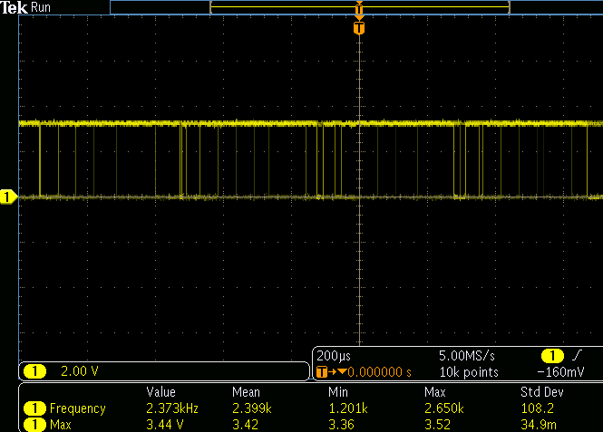
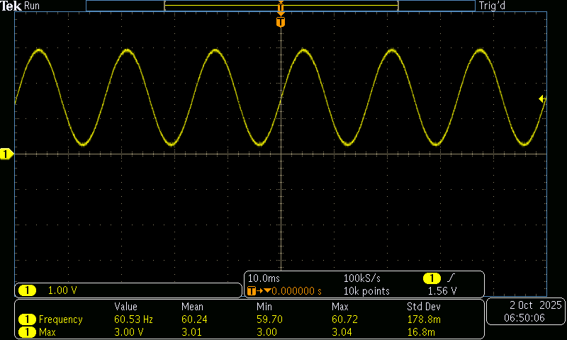

# 🤖 Tarea 7.3: Generación de Señales — Senoidal de 60 Hz con PWM + Filtro RC
> Garcia Cortez Juan David · Arai Erazo Sumie ·  Sistemas Embebidos 1  ·  01/10/2025.

--- 
## Control con frecuencia buzzer
* Entregable:

* Generar una señal sinusoidal aproximada de 60 Hz variando el duty cycle del PWM según una función seno.

* Construir un filtro RC pasabajos básico y verificar la señal en el osciloscopio:

* Documentar:

* Capturas de osciloscopio Antes del filtro (PWM) y Después del filtro.

* Explicación de la frecuencia de corte:

* El filtro RC se diseña para dejar pasar señales de 60 Hz y eliminar las componentes de alta frecuencia que provienen del PWM.

* La frecuencia de corte (fcf_cfc​) es el punto donde el filtro empieza a atenuar las señales. Matemáticamente:

​
* En este caso, queremos que fc sea un poco mayor que 60 Hz para que nuestra señal sinusoidal de 60 Hz no sea atenuada.

* Valores recomendados para un fc≈100Hz

* Opción 1: R=2.2 kΩR C=0.68 μF fc≈106Hz.

* Opción 2: R=1.6 kΩR, C=1 μF  fc≈100Hz

* Conexion:

* La salida de PWM entra en la resistencia.

* Después de la resistencia, conectar el capacitor a tierra.

* El punto entre resistencia y capacitor es la salida filtrada, que se conecta al osciloscopio.
### Código
```bash
// pwm_seno.c — Generar seno 60 Hz con PWM en GPIO 3
#include "pico/stdlib.h"
#include "hardware/pwm.h"
#include <math.h>

#define PIN_PWM    3
#define FREQ_PWM   2000     // 2 kHz portadora
#define TOP        1023     // 10 bits de resolución
#define FREQ_SENO  60       // Señal deseada: 60 Hz

#define PI 3.141592653589793

// Número de muestras por ciclo de seno
#define N_MUESTRAS 100

uint16_t tabla_seno[N_MUESTRAS];

int main() {
    stdio_init_all();

    // --- Generar tabla seno ---
    for (int i = 0; i < N_MUESTRAS; i++) {
        float ang = 2 * PI * i / N_MUESTRAS;
        float val = (sinf(ang) + 1.0f) / 2.0f;  // [0,1]
        tabla_seno[i] = (uint16_t)(val * TOP);
    }

    // --- Configuración PWM ---
    gpio_set_function(PIN_PWM, GPIO_FUNC_PWM);
    uint slice = pwm_gpio_to_slice_num(PIN_PWM);
    uint chan  = pwm_gpio_to_channel(PIN_PWM);

    float f_clk = 125000000.0f; // 125 MHz
    float div = f_clk / (FREQ_PWM * (TOP + 1));
    pwm_set_clkdiv(slice, div);
    pwm_set_wrap(slice, TOP);
    pwm_set_enabled(slice, true);

    // --- Temporización para 60 Hz ---
    // Cada ciclo = 16.67 ms. Dividido en N_MUESTRAS → periodo de actualización:
    float Ts_ms = 1000.0f / (FREQ_SENO * N_MUESTRAS); // ~0.167 ms (167 µs)

    int idx = 0;
    while (true) {
        pwm_set_chan_level(slice, chan, tabla_seno[idx]);
        idx = (idx + 1) % N_MUESTRAS;
        sleep_us((int)(Ts_ms * 1000));
    }
}
```

#Señal No Filtrada


#Señal Filtrada

